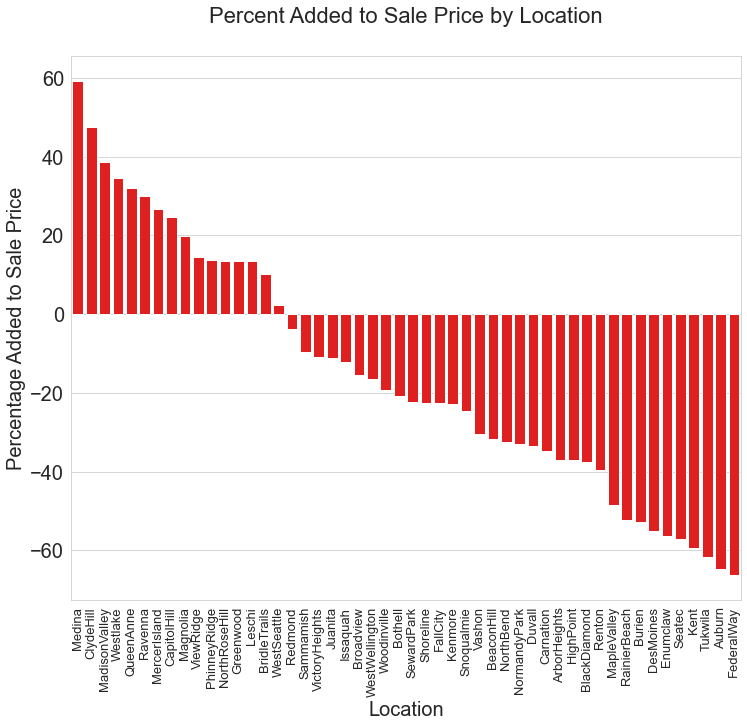

## Project Overview

We are producing a new game show -- 'King's Contest' -- in which a group of contestants and a group of experts working for the show are both given a lump sum to buy a house to buy in King County, WA. Both teams then sell their house, and if the contestants make more profit than the experts, then they get to keep the money from the house sale.  

It is obviously in our best interest to minimise the chance of this happening. To this end, we analyze a year of housing sales from the county to generate a model showing how various features of a house are correlated to its sale price.  

We then use his model to focus our search and find the most undervalued houses on the market, maximising the chances of winning the contest.  

The inferential model revealed that being by the water, the location, living space and the grade of the house gave the biggest boost to prices.  

The average prediction error from the model is about 20%, although that falls to 10% in certain locations, meaning we can be confident of finding underpriced houses.  

Being wrong occassionally is no bad thing as we need to lose the contest from time to time in order to keep the show interesting and win the ratings war.

 
 

### Business Problem

To attract high ratings with an entertaining show that strikes a good balance between difficulty and achievability.  

This relies upon the expert team winnnig most of the time.  

We also need to make sure we stack the odds in our favour in order not to keep having to pay out the big prize.

 
 

### The Data

Data drawn from the dataset of house sales in King County, WA, between May 2014 and May 2015.

 
 

### Methods

The dataset of over 2,0000 sales was analyzed to find the strength of relationships between features of a house and its achieved sale price.  

The end goal was to create an accurate model, using the features most related to the price, and which boosted them the most.  

To do this, we created a series of models, each with gradually fewer features as we got rid of those that were either irrelevant to the task, or which had little effect on price.

Each model was then put to the test with previously unseen data, and its perfomance calculated in terms of how accurately it could account for the actual price.  

In order to investigate the link between a house's location and its sale price, we added the city that the house's zipcode is registered to, or neighbourhood in the case of Seattle, as a new feature.  

 
 

### Headline Results
 

**The model revealed that being by the waterfront, the grade of the house and its living space gave the biggest boost to prices.**  
 
 

**Location was also found to be a key factor, with the popularity of Medina, Clyde Hill, and Madison Valley all giving houses in the area a higher valuation.**  
 
 

 
 

* **The number of bedrooms and bathrooms is less important than the size of the living space and location.**
 

 
 

### Conclusion

This analysis leads to three recommendations for the show's producers to maximise the odds of winning each week, while keeping the show competitive enough to attract viewers.

**The house (nearly) always wins** 

* In order to stack the odds in our favour, we focus the search in the 10 neighbourhoods where the model performs the best.
* These are; Snoqualmie, Bothell, Sammamish, Woodinville, Juanita, Kenmore, Maple Valley, Issaquah, West Wellington and Redmond.

**Million dollar challenge**

* The contestants and experts should both be given $500,000 to buy a house, as that is the general going rate for properties in our favoured locations.

**Big is beautiful**

* The most desirable feature is a waterfront property, but their rarity means finding such a bargain will not be the main weekly consideration. Instead we should focus on living space and the grade.

### Next steps

*  Keep collecting data on latest sale prices as we need to be ahead of the game in discerning shifts in trends, and in knowing which places are hot, and which are not.

* Collect data on whether there has been shift in which features add most value to a house in light of the pandemic, for instance...

* Does living space and outdoor space now come at an even higher premium given people's experiences of being locked down? 

* Has proximity to urban centres become less desirable now working from home has become more popular?
 

 
 
